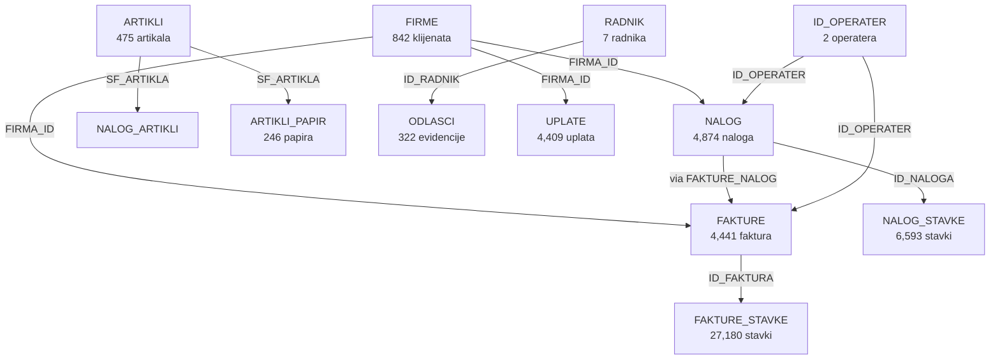

# DETALJNE STRUKTURE BAZA - BazaBrain.mdb i HARMON.mdb

## 📊 BazaBrain.mdb - GLAVNA POSLOVNA BAZA
**Lokacija:** `/old-aplicaiton/backup-db/poslednji-bekap/BazaBrain.mdb`  
**Broj tabela:** 104  
**Tip sistema:** Štamparija/Print shop management

### 🔑 KLJUČNE ENTITETE I NJIHOVE VEZE

## 1️⃣ SISTEM FAKTURISANJA

### FAKTURE (4,441 zapisa)
```
ID_FAKTURA (PK) → glavni identifikator
GODINA → fiskalna godina
VR_FAKTURA → tip fakture (FK → VR_FAKTURE)
BROJ_FAK → broj fakture
FIRMA_ID (FK → FIRME) → klijent
ID_PREDUZECE (FK → ID_PREDUZECE) → izdavalac
DATUM → datum izdavanja
IZNOS, PDV, RABAT → finansijski podaci
W_IKOF, W_JIKR → fiskalni podaci
ID_OPERATER (FK → ID_OPERATER) → operater
```

### FAKTURE_STAVKE (27,180 zapisa)
```
ID_FAKTURA (FK → FAKTURE) → veza sa fakturom
ID_FAKTURA_STAVKE → ID stavke
TEKST → opis stavke
KOMADA, JEDINICA → količina
CIJENA, CIJENA_PDV → cene
RABAT, PDV → porezi
```

### FAKTURE_NALOG (6,736 zapisa)
```
ID_FAKTURA (FK → FAKTURE)
ID_NALOGA (FK → NALOG) → veza sa radnim nalogom
ID_NALOGA_STAVKE (FK → NALOG_STAVKE)
```

## 2️⃣ SISTEM RADNIH NALOGA

### NALOG (4,874 zapisa) - Centralna tabela
```
ID_NALOGA (PK) → identifikator naloga
NAZIV → naziv posla
FIRMA_ID (FK → FIRME) → klijent
DATUM, DATUM_ROK → vremenske odrednice
ST_NALOGA (FK → ST_NALOGA) → status naloga
ID_OPERATER_ODGOVORNO → odgovorna osoba
ELEMENTI → opis elemenata posla
```

### NALOG_STAVKE (6,593 zapisa)
```
ID_NALOGA (FK → NALOG)
ID_NALOGA_STAVKE (PK)
VR_KALKULACIJE → tip kalkulacije
NAZIV → naziv stavke
C_POSLA → cena rada
ST_STAVKE → status stavke
```

### Specijalizovani nalozi (prema tipu štampe):
- **NALOG_OFFSET** - offset štampa
- **NALOG_DIGITALNA** - digitalna štampa  
- **NALOG_KLIK** - klik štampa
- **NALOG_VELIKI_FORMATI** - plotovanje
- **NALOG_OBRADA_CTP** - CTP ploče
- **NALOG_WEB** - web dizajn
- **NALOG_OSALO** (9,165 zapisa) - ostali poslovi

## 3️⃣ SISTEM ARTIKALA

### ARTIKLI (475 zapisa)
```
SF_ARTIKLA (PK) → šifra artikla
NAZIV → naziv
VR_ARTIKLA (FK → VR_ARTIKLA) → tip artikla
KOL_ULAZNA, KOL_IZLAZNA → stanje zaliha
CIJ_NABAVNA, CIJ_PRODAJNA → cene
VR_JEDINICA → jedinica mere
```

### ARTIKLI_PAPIR (246 zapisa) - Specijalizovano za papir
```
SF_ARTIKLA (FK → ARTIKLI)
VR_FORMAT → format papira (A4, A3, etc.)
X, Y → dimenzije
TEZINA → gramatura
TIP → tip papira
BRZINA_SPORA/NORMALNA/BRZA → brzine štampe
```

## 4️⃣ SISTEM FIRMI/KLIJENATA

### FIRME (842 zapisa)
```
FIRMA_ID (PK) → identifikator
NAZIV_FIRME → naziv
PIB, MB → poreski podaci
ADRESA, GRAD, DRZAVA → lokacija
TELEFON, EMAIL → kontakt
ZIRO_RACUN → bankovni račun
ID_CIJENA → cenovnik
```

### FIRME_KONTAKT (85 zapisa)
```
FIRMA_ID (FK → FIRME)
REDNI_BR → redni broj kontakta
OSOBA_MJESTO → ime kontakta
EMAIL, TEL, FAX → kontakt podaci
```

## 5️⃣ SISTEM UPLATA

### UPLATE (4,409 zapisa)
```
ID_UPLATE (PK)
FIRMA_ID (FK → FIRME) → platilac
IZNOS → iznos uplate
DATUM → datum uplate
VR_UPLATE (FK → VR_UPLATE) → način plaćanja
ID_ZIRO_RACUNA → račun primaoca
```

## 6️⃣ SISTEM RADNIKA

### RADNIK (7 zapisa)
```
ID_RADNIK (PK)
IME_PREZIME
FIRMA_ID (FK → FIRME) → ako je eksterni
VR_RADNIKA → tip radnika
```

### ODLASCI (322 zapisa) - Evidencija rada
```
ID_RADNIK (FK → RADNIK)
DATUM, DATUM_KRAJ
VR_DOLASCI, VR_DOLASCI_KRAJ
PRISUSTVO, KASNJENJE, PREKOVREMENI
```

## 7️⃣ ŠIFARNIČKI SISTEM (Lookup tabele)

### Tipovi i vrste:
- **VR_FAKTURE** (6) - tipovi faktura
- **VR_ARTIKLA** (11) - tipovi artikala
- **VR_FORMAT** (40) - formati papira
- **VR_BOJA** (40) - boje za štampu
- **VR_MASINA** (2) - tipovi mašina
- **VR_KALKULACIJE** (8) - tipovi kalkulacija
- **ST_NALOGA** (3) - statusi naloga
- **ST_FAKTURE** (2) - statusi faktura

---

## 🔧 HARMON.mdb - KONFIGURACIONA BAZA
**Lokacija:** `/old-aplicaiton/backup-db/HARMON.mdb`  
**Broj tabela:** 1

### KONFIG_APL_OBJ (1 zapis)
```
NAZIV → naziv konfiguracije
EXT → ekstenzija
DIR → direktorijum
DATUM → datum izmene
SADRZAJ → binarna konfiguracija
DUZINA → veličina
```

---

## 🔗 DIJAGRAM MEĐUZAVISNOSTI



## 📈 STATISTIKE

### Volumen podataka:
- **Fakture:** 4,441 + 27,180 stavki = ~31,000 zapisa
- **Nalozi:** 4,874 + 6,593 stavki + 9,165 ostalo = ~20,000 zapisa  
- **Firme:** 842 + 85 kontakata = ~900 zapisa
- **Artikli:** 475 + 246 papir = ~700 zapisa
- **Uplate:** 4,409 zapisa

### Ključni identifikatori:
- `ID_FAKTURA` - glavni ključ faktura
- `ID_NALOGA` - glavni ključ naloga
- `FIRMA_ID` - glavni ključ firmi
- `SF_ARTIKLA` - šifra artikla
- `ID_RADNIK` - identifikator radnika

### Fiskalni podaci:
- Tabele sa prefiksom `W_` u FAKTURE su za fiskalizaciju
- `ID_CONFIG_FISKAL` - konfiguracija fiskalnog sistema
- `Fiskal_log.mdb` - dodatna baza za fiskalne logove